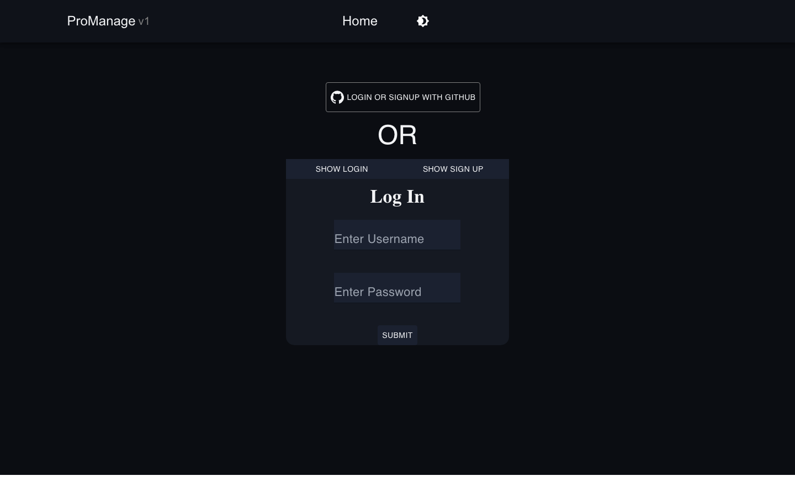
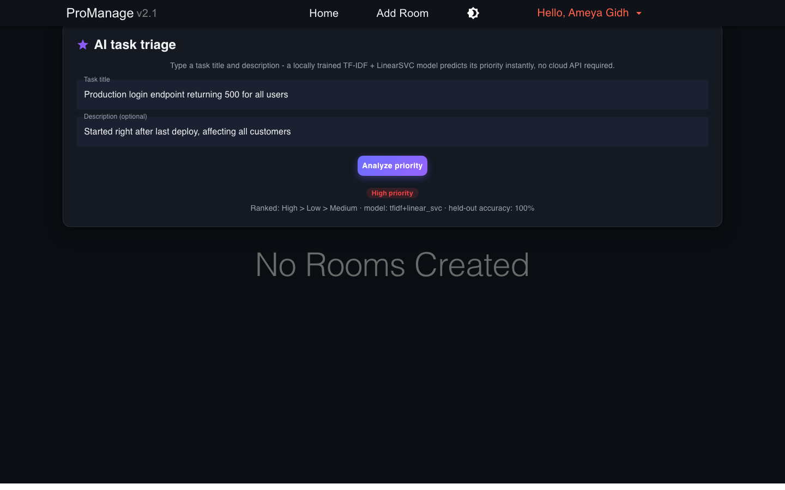
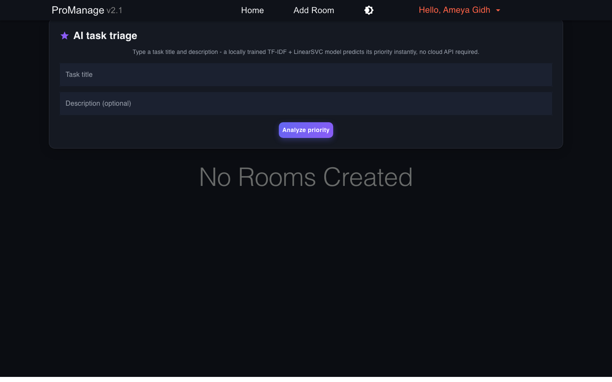
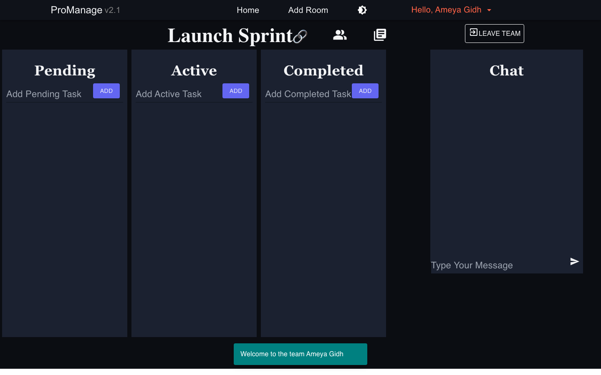

# ProManage

A real-time, multi-user project management platform built on the MERN stack, with an
AI microservice that triages incoming tasks by predicted priority. Teams create rooms
("projects"), organize work across Pending / Active / Completed columns with live
drag-and-drop, and chat in real time - all backed by MongoDB and Socket.IO.

## Screenshots

| Login | AI task triage |
|---|---|
|  |  |

| Home | Kanban board |
|---|---|
|  |  |

More in [`docs/screenshots/`](docs/screenshots/). See [`docs/TECHNICAL.md`](docs/TECHNICAL.md)
for the full architecture and AI pipeline write-up.

## Features

- **Real-time Kanban boards** - drag tasks between Pending, Active, and Completed columns
  (`react-beautiful-dnd`), synced across all room members over Socket.IO.
- **AI task triage** - type a task title/description and get an instant priority
  prediction (High/Medium/Low) from a locally trained TF-IDF + LinearSVC model. No
  API key or network call required; see [ProManageAI](ProManageAI/).
- **Rooms with role-based access** - room owners can promote/demote members and block
  users; GitHub-repo-backed rooms are auto-created for a user's public repos.
- **Live chat with priority flags** - high-priority chat messages email other room
  members (optional, requires SMTP credentials).
- **Dark/light theme** - a shared design-token palette (`src/contexts/ThemeContext.js`)
  used across every screen.

## Tech stack

| Layer | Technology |
|---|---|
| Frontend | React 17, MUI 5 / Material-UI 4, react-beautiful-dnd, socket.io-client |
| Backend | Node.js, Express, Socket.IO, Mongoose |
| Database | MongoDB |
| AI service | Python, FastAPI, scikit-learn (TF-IDF + LinearSVC), optional LangChain |
| Testing/tooling | Playwright (screenshot generation) |

## Running it locally

Three processes: MongoDB, the Express/Socket.IO API, the AI microservice, and the
React client.

```bash
# 1. MongoDB - point at any local or hosted instance
mongod --dbpath /path/to/data   # or use an existing local mongod service

# 2. Backend
cd ProManageServer
cp .env.example .env            # fill in MONGODB_URI at minimum
npm install
npm start                        # http://localhost:4000

# 3. AI microservice
cd ../ProManageAI
python3 -m venv .venv && source .venv/bin/activate
pip install fastapi "uvicorn[standard]" scikit-learn joblib
python train_triage.py           # trains and saves model/triage_model.joblib
uvicorn main:app --port 8001     # http://localhost:8001

# 4. Frontend
cd ../ProManageClient
cp .env.example .env             # REACT_APP_BACKEND_URL=http://localhost:4000
npm install
npm start                        # http://localhost:3000
```

Sign up with a username/password on the login screen (the GitHub-OAuth login path
needs `GITHUB_CLIENT_ID`/`GITHUB_SECRET_KEY`, which are optional).

## AI/ML pipeline

| Feature | Model | Input | Output |
|---|---|---|---|
| Task auto-triage | TF-IDF (1-2 grams) + LinearSVC | task title + description | priority: High/Medium/Low, ranked by decision margin |
| Standup summary | Extractive term-frequency scoring, or LangChain + Claude/GPT if `LLM_PROVIDER` + an API key is set | recent room activity logs | 3-sentence summary |

The triage model trains in seconds from `ProManageAI/data/tasks_corpus.csv` (364
labelled examples) and is checked into `ProManageAI/model/triage_model.joblib`, so no
training step is required to run the app - `train_triage.py` is there for reproducing
or extending it. See `docs/TECHNICAL.md` for the full pipeline and honest accuracy
caveats.

## Security note

An earlier version of this repo had a MongoDB Atlas connection string (including a
password) hardcoded in `ProManageServer/index.js`. It has been moved to an
environment variable (`MONGODB_URI`, see `.env.example`). If you're the repo owner:
**that credential should be treated as compromised and rotated**, since it was public
in git history regardless of the code fix.

## License

[MIT License](LICENSE)
